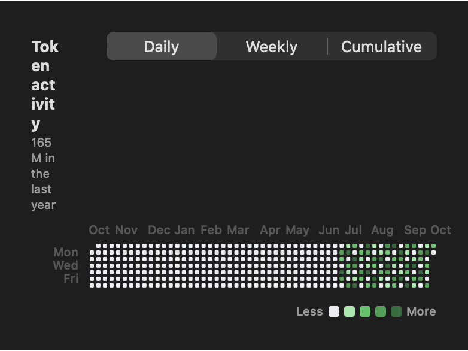
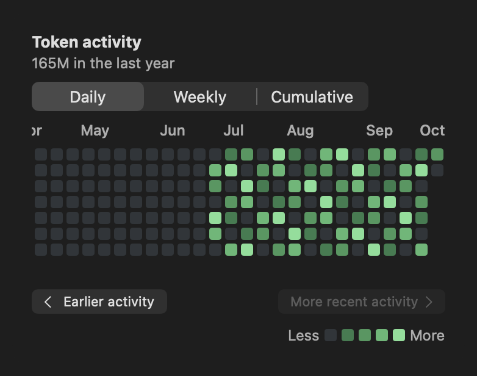
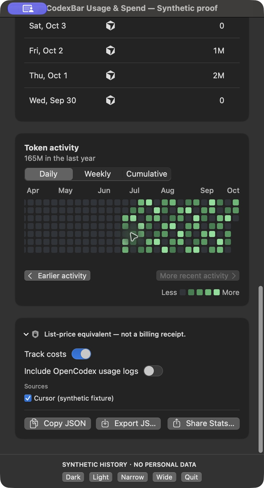

# Token activity readability

These are native SwiftUI component renders using fixed synthetic activity and a fixed date. The displayed total is a test fixture; no personal usage, account history, or original user screenshot is included. The images cover the component, not an installed full-app session.

At 339 points of content width, the previous layout squeezed the entire year into tiny cells and let the English title wrap into a narrow column. The updated layout keeps days at least 10 points wide, defaults to the recent end, and provides labeled navigation with overlapping weeks. At 760 points, the year fits and the navigation row disappears.

## Before: narrow Dark mode

Rendered with the same synthetic input against the unmodified base implementation.



## After: narrow Dark mode, recent end



## After: narrow Dark mode, earliest end


## After: narrow Light mode


## After: wide Dark mode


## Native proof

To enable the optional native rendering, mouse-click, and date-reveal tests from the repository root on macOS:

```bash
source Scripts/test_environment.sh
CODEXBAR_ACTIVITY_READABILITY_PROOF_DIR="$PWD/.build/activity-proof" \
  swift test --filter 'SpendActivityAppearanceTests|SpendActivityHeatmapTests|SpendActivityReadabilityRenderTests|LocalizationLanguageCatalogTests|LocalizationBundleTests|UserFacingLocalizationCoverageTests'
```

The final focused run passed 85 Swift Testing tests and all 3 enabled native XCTest cases. The screenshot matrix produced 80 images across Chinese/English, Light/Dark mode, 339/520/760-point widths, all three activity modes, partial coverage, and zero activity. Native mouse events changed the 339-point viewport offsets through `350, 26, 0, 0, 325, 350, 350`: both ends are reachable, and clicking the disabled end controls does not move the viewport.

`make check` passed. The complete repository suite on final product commit `f3a75a5c974fbcc9d01e9318850154187d4d3bed` passed all **143/143 groups on the first attempt**, using the repository's inventory-verified direct runner with four workers (`python3 Scripts/ci_swift_test_by_suite.py --direct-workers 4`). It verified all 13,837 test methods before execution; no groups were filtered out, and no failures, retries or timeouts occurred. The earlier standard `make test` run also completed all 143 groups, with one group recovered through the script's 12 isolated retries. Both runs are recorded in the [sanitized receipt](full-test-receipt.json).

The unchanged cached-title performance test passed its original 50 ms budget in both complete runs. A clean upstream-base renderer suite also passed 83/83 tests on the same host. Another isolated PR renderer run failed the budget at 85.7 ms, so timing variability remains observed and its exact cause is undetermined; renderer source and test are byte-identical to the base. No test or threshold was relaxed.

The final focused Swift Testing selection passed 85 tests. The three enabled native XCTest cases passed on an unchanged isolated rerun; the initial native run had one asynchronous navigation-click assertion fail. The full-app evidence separately verifies actual UI button clicks, boundaries, date inspection, keyboard reveal, and selection.

## Integrated runtime evidence

The [fresh complete-app proof](runtime/README.md) includes paging, keyboard date reveal, tooltip/date selection, Light mode, wide layout, mode switching and exposed accessibility actions. The final accessibility adjustment places virtual day/week descriptions on the inner chart, so the scroll area's earlier/recent controls remain accessible.



All public evidence uses explicitly synthetic history. Raw originals and machine-specific logs remain local; public window captures have ancillary metadata removed without changing the encoded raster. Physical trackpad and spoken VoiceOver sessions remain unverified.
