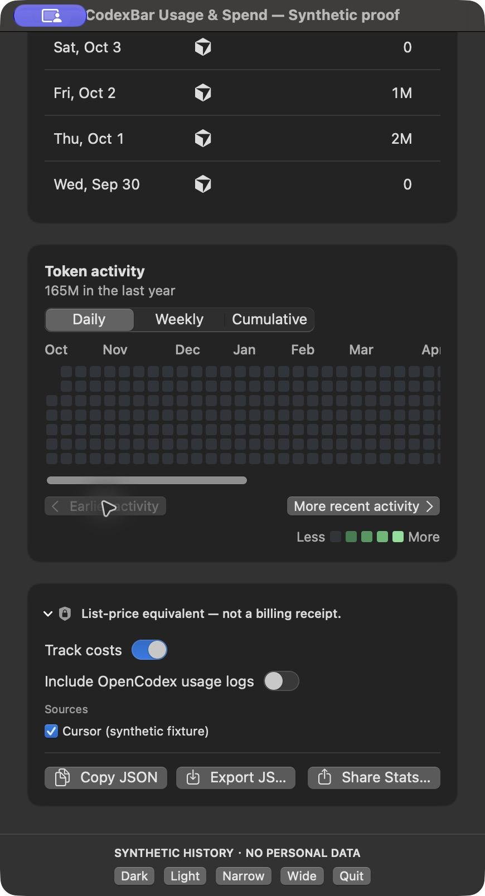
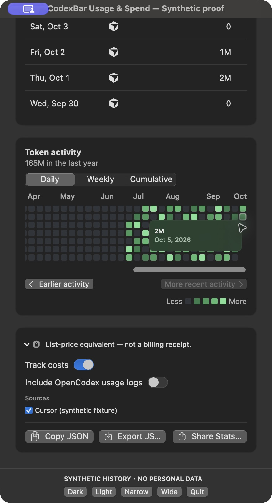
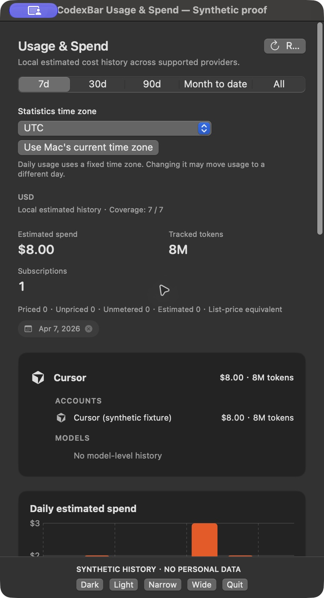
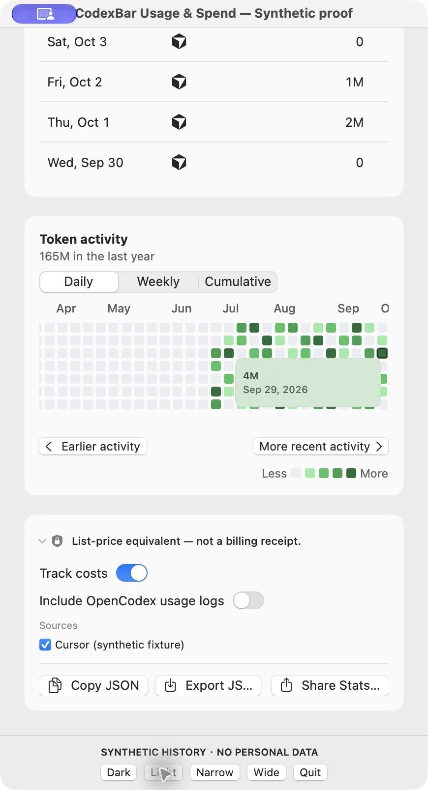
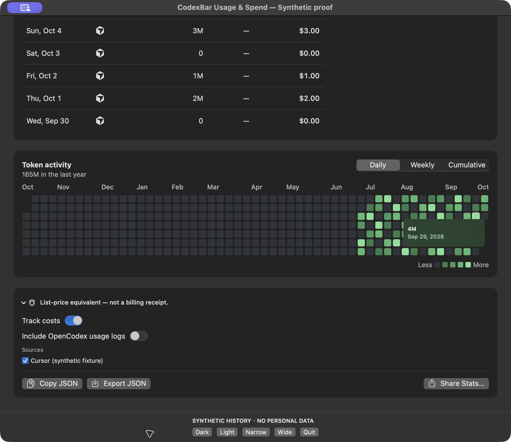
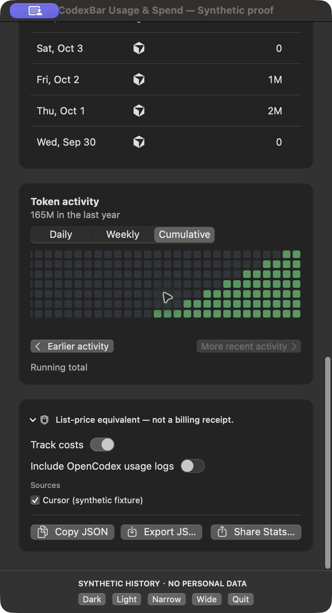

# Complete Usage & Spend proof

These are actual window captures from a newly packaged, ad-hoc signed debug CodexBar executable built against product commit `f3a75a5c974fbcc9d01e9318850154187d4d3bed`. The host is the complete production `SpendDashboardPane`, its controller, and data model. The only app entrypoint addition is the opt-in proof launcher; the production activity source matches the PR. This is an isolated full-app session using **fixed synthetic history**, not a live personal account or an installed production-account session.

All displayed accounts, model names, token counts, and amounts are generated fixtures. The app uses 2026-10-06 UTC and 365 generated daily entries, in-memory preferences/token stores, disabled Keychain access, and a provider transport override that fails if attempted. Normal app startup is bypassed. Raw originals, logs and timestamps remain private. Public screenshots have ancillary JPEG metadata removed; the encoded raster was preserved without compositing or re-encoding. The [sanitized receipt](runtime-receipt.json) includes source and image hashes.

## Paging and boundary controls

At 435 points of window width, the activity viewport is 355 points wide and the annual content is 689 points. Its initial offset is 334. Actual UI clicks changed the offset through `334 → 0 → 0 → 334 → 334`: both ends are reachable, and disabled controls retain their end position. Earlier/recent buttons appear as separate accessible buttons with their expected enabled/disabled states.

## Date inspection and pane-to-controller selection

Native accessibility date adjustments exposed `Oct 6, 2026: 0` and `Oct 5, 2026: 2M`, with the tooltip visibly contained in the viewport. A real grid click selected `2026-04-07` in the production controller and displayed the date filter chip in the surrounding pane.

## Keyboard date reveal

With the activity control focused, a Left key showed Sep 28. Paging earlier moved the viewport to offset 0. A Down key changed the inspection date to Sep 29 within the same week and revealed it at offset 321. The tooltip stayed inside the visible area.

## Appearance, width, and other modes

Light mode uses its own palette. At 930 points of window width, the activity content and viewport both measure 850 points: the entire year fits, offset is 0, and the navigation buttons disappear from the accessibility tree. Actual picker clicks switched Daily, Weekly and Cumulative modes. Narrow Weekly/Cumulative controls remained separately accessible, and the native horizontal accessibility scroll action reached offset 0 in Cumulative mode.

## Reproduction

Run `bash docs/images/token-activity-readability/runtime/launch.sh` from the PR checkout on macOS. It creates and retains a separate worktree, builds a debug app, ad-hoc signs it, and launches the isolated pane. It does not replace an installed app. The proof bundle fails closed when opened without its required isolation environment.

The footer changes width/appearance and quits the proof app. Capture only its window using UI tooling; local state receipts record activity mode, selected dates and nested scroll offsets. The generated in-memory defaults helper adds KVO notifications so picker changes reach SwiftUI, without writing user preferences.

This proves exposed accessibility actions and keyboard interaction. A physical trackpad gesture and a spoken VoiceOver session were not tested. Existing native component rendering, mouse-event tests and localization checks are documented in the parent README.
